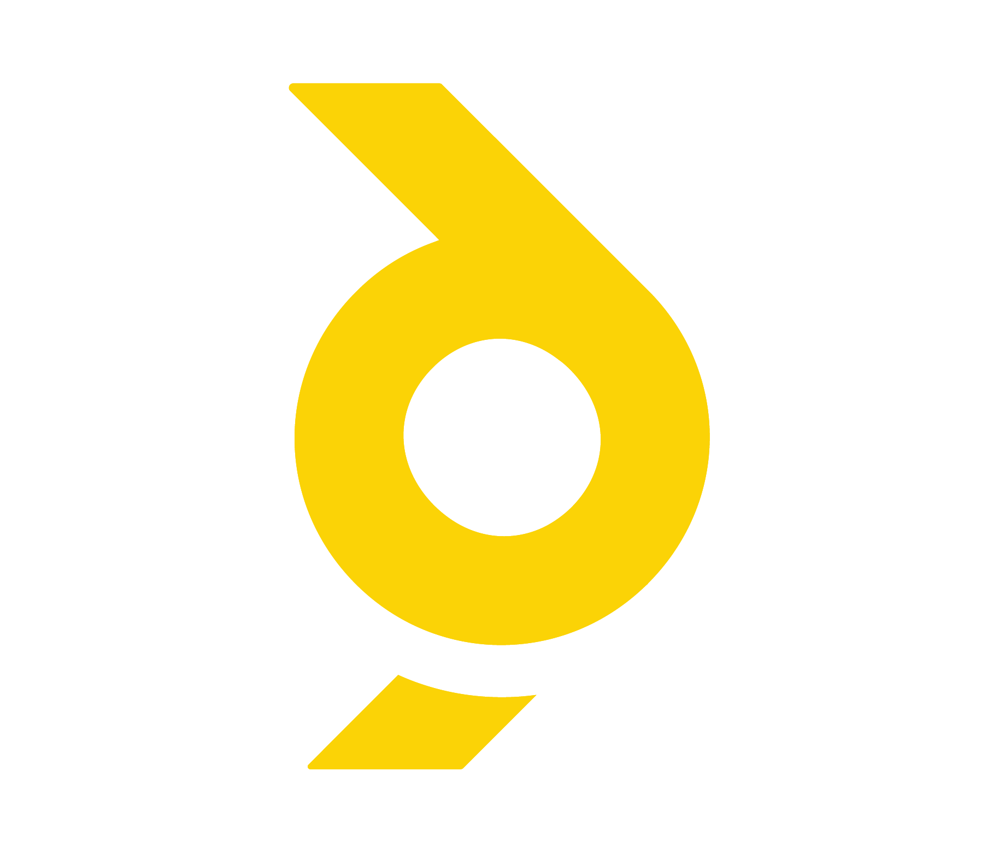

<div align="center">



# 🛸 Drone Trainer-Trainee GCS

**A Raspberry Pi ground control station for dual-pilot RC drone training.**  
The trainer flies. The trainee watches. One switch hands over the controls.

[](https://python.org)
[](https://mavlink.io)
[](https://raspberrypi.org)
[](LICENSE)

</div>

---

## What it does

A Raspberry Pi sits between a trainer pilot and a trainee pilot. It monitors both, decides who is in control, displays live telemetry on a tiny TFT screen, and announces key events by voice.

```
Trainer TX12 (RF) ──────────────────► Flight Controller
                                             │
                                       MAVLink / USB
                                             │
Trainee TX12 (USB) ──► Raspberry Pi ◄────────┘
                              │
                        TFT Display
                        Speaker (TTS)
```

When the trainer flips **CH10**, control transfers to the trainee's USB joystick in real time. Flip it back — control returns instantly. Both disconnect events are detected, announced, and recovered from automatically.

---

## Features

| Feature | Detail |
|---|---|
| **Live telemetry display** | GPS fix, flight mode, altitude, arm status on 128×160 TFT |
| **Trainer / Trainee header** | Screen shows who is currently flying |
| **RC override at 20 Hz** | Trainee joystick axes → MAVLink `RC_CHANNELS_OVERRIDE` |
| **Voice alerts** | Mode changes, control transfer, disconnect events via TTS |
| **Prearm status** | FC prearm errors translated and shown every 5 seconds |
| **Auto reconnect** | Spinning reconnect screen for both master and slave disconnect |
| **Clean shutdown recovery** | Each device disconnect handled independently, no app crash |

---

## Hardware required

- Raspberry Pi (any model with SPI + USB)
- ArduPilot / PX4 flight controller (USB)
- RadioMaster TX12 or compatible joystick (USB, slave)
- ST7735R 128×160 TFT display (SPI)
- Speaker or 3.5mm audio output (for TTS)

### TFT wiring (SPI)

```
TFT Pin   →   Raspberry Pi GPIO
─────────────────────────────────
VCC       →   3.3V  (Pin 1)
GND       →   GND   (Pin 6)
SCL       →   GPIO11 / SCLK (Pin 23)
SDA       →   GPIO10 / MOSI (Pin 19)
CS        →   GPIO8  / CE0  (Pin 24)
DC        →   GPIO25        (Pin 22)
RST       →   GPIO24        (Pin 18)
```

---

## Installation

```bash
# Clone the repo
git clone https://github.com/yourname/drone-trainer-gcs.git
cd drone-trainer-gcs

# Install dependencies
pip install pygame pymavlink pillow pyttsx3 pyserial \
            adafruit-circuitpython-rgb-display adafruit-blinka

# Enable SPI on the Pi
sudo raspi-config   # Interface Options → SPI → Enable
```

---

## Usage

```bash
python main.py
```

The boot screen shows three blocks filling in sequence:

```
█  Power on
█  MAVLink connected  (FC USB plugged in)
█  Slave connected    (Trainee joystick plugged in)
```

Once all three are filled the system goes live.

### Handing over control

| Action | Result |
|---|---|
| Flip CH10 **high** on master TX | Trainee joystick takes control |
| Flip CH10 **low** on master TX | Master TX resumes control |
| Unplug trainee USB | Reconnect screen, voice alert |
| Unplug FC USB | Reconnect screen, voice alert |

---

## Architecture

```
┌─────────────────────────────────────────────────────────┐
│                        main.py                          │
│                                                         │
│  DroneGCS  ──  state machine: BOOT → ACTIVE → RECONNECT │
│  MAVLinkReader  ──  parses telemetry, detects CH10      │
└───────────────────────────┬─────────────────────────────┘
                            │ SharedFlags (flags.py)
           ┌────────────────┼────────────────┐
           ▼                ▼                ▼
   MAVLinkFlagThread  JoystickFlagThread  RCOverrideThread
   mavlink_thread.py  joystick_thread.py  rc_override_thread.py
   connects serial    watches /dev/input   reads axes → FC 20Hz
```

### Threads at a glance

| Thread | File | Job | Lifespan |
|---|---|---|---|
| `MAVLinkFlagThread` | `mavlink_thread.py` | Opens serial port, sets `mavlink_connected` | Forever |
| `JoystickFlagThread` | `joystick_thread.py` | Detects joystick plug / unplug | Forever |
| `RCOverrideThread` | `rc_override_thread.py` | Sends joystick axes to FC at 20 Hz | Forever |
| `MAVLinkReader` | `main.py` | Parses all MAVLink telemetry | Killed on disconnect, re-spawned on reconnect |
| Render loop | `main.py` | Updates TFT display + TTS | Forever |
| **Main thread** | `main.py` | State machine, boot/reconnect screens | Forever |

### SharedFlags — thread-safe state bus

All threads communicate through a single `SharedFlags` object. It uses a `threading.Lock` to prevent race conditions and a `threading.Event` as a doorbell — any flag change wakes the state manager immediately instead of polling every millisecond.

```python
flags.mavlink_connected   # bool — FC serial alive
flags.slave_connected     # bool — USB joystick present
flags.rc10_active         # bool — trainee in control
flags.mavlink_master      # MAVLink connection object (shared)
flags.disconnected_device # "master" | "slave" | None
```

---

## File reference

```
main.py               Core — DroneGCS state machine + MAVLinkReader
flags.py              SharedFlags — thread-safe state bus
mavlink_thread.py     MAVLinkFlagThread — serial connection manager
joystick_thread.py    JoystickFlagThread — USB joystick watcher
rc_override_thread.py RCOverrideThread — control transfer at 20 Hz
stfinal.py            DroneDisplay — SPI TFT rendering
boot.py               boot_screen + reconnect_screen
errors.json           Prearm error translation table
Y.png                 Boot screen logo
```

---

## Prearm errors

The system polls the FC for prearm errors every 5 seconds while disarmed. Raw FC messages are translated using `errors.json` to short strings that fit the display:

| FC message | Display |
|---|---|
| `PreArm: GPS not healthy` | `No GPS fix` |
| `PreArm: Gyro not calibrated` | `Gyro issue` |
| `PreArm: Battery too low` | `Battery low` |
| `PreArm: Barometer not healthy` | `Barometer failure` |
| *(no errors)* | `READY TO ARM` |

---

## RC channel mapping

| Channel | Control | Source when slave active |
|---|---|---|
| CH1 | Roll | Trainee joystick axis 0 |
| CH2 | Pitch | Trainee joystick axis 1 |
| CH3 | Throttle | Trainee joystick axis 2 |
| CH4 | Yaw | Trainee joystick axis 3 |
| CH5–CH8 | Modes / switches | Master TX (passthrough) |
| CH10 | Control transfer switch | Master TX |

CH5–CH8 always stay under master TX control via MAVLink `PASSTHROUGH = 65535`.

---

## Dependencies

| Package | Purpose |
|---|---|
| `pygame` | USB joystick input |
| `pymavlink` | MAVLink serial protocol |
| `pillow` | TFT image rendering |
| `pyttsx3` | Text-to-speech alerts |
| `pyserial` | Serial port handling |
| `adafruit-circuitpython-rgb-display` | ST7735 TFT driver |
| `adafruit-blinka` | CircuitPython GPIO layer |

---

## Axis calibration

If the joystick axes are mapped differently on your TX12, update these constants in `rc_override_thread.py`:

```python
AXIS_ROLL     = 0   # right stick X
AXIS_PITCH    = 1   # right stick Y
AXIS_THROTTLE = 2   # left  stick Y
AXIS_YAW      = 3   # left  stick X
```

To find your axis indices, run:
```bash
jstest /dev/input/js0
```

---

<div align="center">

Built for real flight training on real hardware.

</div>